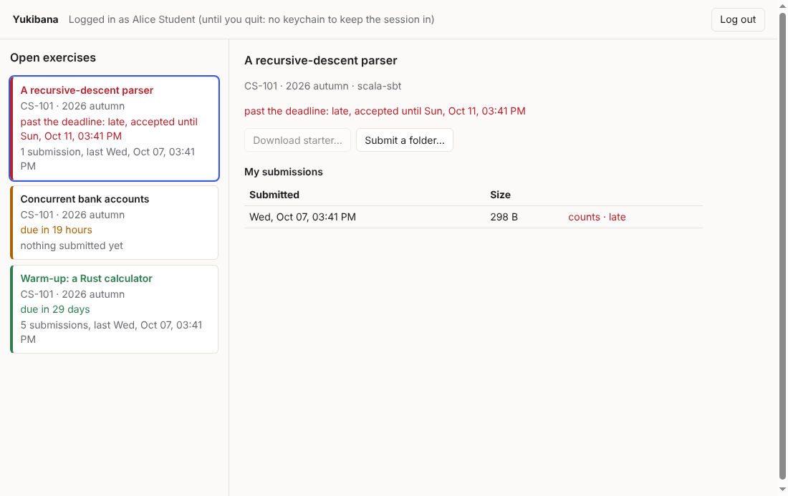
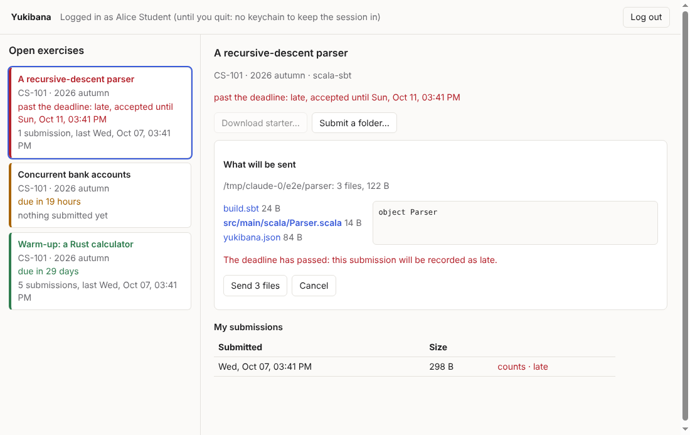

# Yukibana desktop demo

A student's client for Yukibana Cloud in about 500 lines of TypeScript: log
in through the browser, see the exercises open to you, download a starter,
preview exactly what a folder would submit, send it, and see your
submissions, late ones marked. Everything Yukibana-specific is a call into
`@yukibana/cli`'s library, so this is a worked example of what a Theia
extension does (`docs/theia.md`).





## Run it

```bash
npm run build --prefix ../../cli    # the library, once
npm install
YUKIBANA_URL=http://127.0.0.1:5173 npm start
```

`YUKIBANA_URL` is what the login screen offers; the default is
`https://cloud.yukibana.dev`. Against the local stack, start it and the app
first (the repository's README).

## How it is put together

| | |
| --- | --- |
| `src/main.ts` | The main process. Owns the session, the `YukibanaClient` and every bundle, and answers the window over IPC. |
| `src/safe-store.ts` | A `SessionStore` over Electron's `safeStorage` (the OS keychain). Without a keychain the session stays in memory. |
| `src/bridge.ts` | The contract between window and main process. The window never holds a token or touches the disk. |
| `src/preload.cts` | Forwards exactly the bridge's methods; nothing else reaches the page. |
| `src/view.ts` | Every word the screen says about an exercise or a submission, as pure functions; `tests/view.test.ts`. |
| `src/renderer.ts` | Plain DOM. Every string goes in as text, never as HTML. |

The list is what the registry returns: a student only ever receives the
exercises of their own editions whose window is open (available, and not
yet closed). Past the deadline an exercise stays open until it closes, and
what is submitted then is marked late; the database decides both.

## Without a person

`YUKIBANA_ACCESS_TOKEN` stands in for a login, `YUKIBANA_DEMO_SCREENSHOT=<png>`
saves the window once it has drawn and quits, and `YUKIBANA_DEMO_FOLDER=<dir>`
answers folder dialogs (and opens the submit preview for the screenshot).
The screenshots above were made with all three under `xvfb-run`, against the
local stack.
